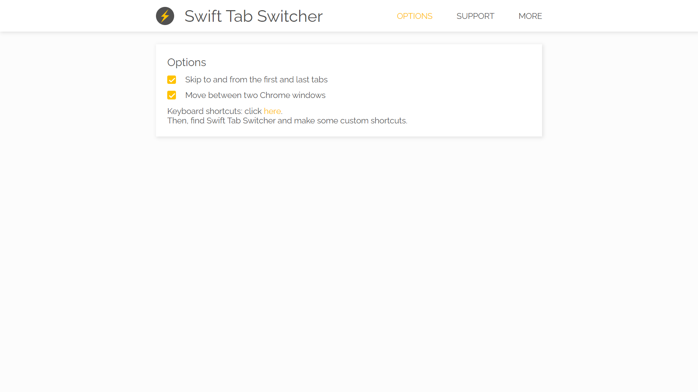
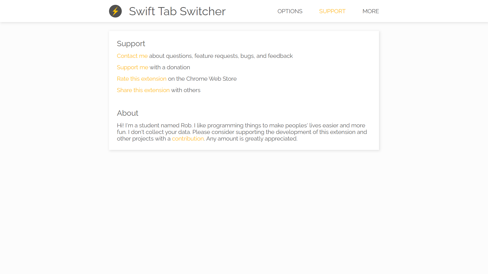

# Swift Tab Switcher

## Free Extension

https://chrome.google.com/webstore/detail/swift-tab-switcher/pdncaffclfaalcafoebejjbefknohkjg

## Introduction

Use shortcuts to quickly switch your current tab. Tired of clicking on your tabs? Use keyboard shortcuts instead. This extension makes it easy to navigate whether you have 3 tabs or 100 tabs. Make your browser navigation lightning-quick with Swift Tab Switcher.

## Features

###### Tab Switching
* Using any keyboard shortcuts supported by Chrome.

###### Settings
* Skip to and from the first and last tabs
* Enable dual window support

###### Chrome Sync
* Saves your options for use on any computer.

## Technologies

###### Frontend:
* JavaScript
* [Chrome Extension API](https://developer.chrome.com/docs/extensions/reference/)
